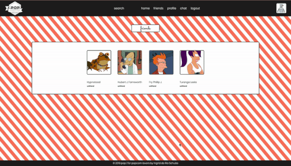

# about

POP for popcorn lovers was developed to be the first community dedicated to users who love popcorn. The POP users can feel safe in sharing all things related to our beloved popped corn.
Users that do not love popcorn yet and want to learn are welcomed.

# features

## home, register or login and wall posts

Users are welcomed with an animation of popcorns popping. After registering or logging in they will navigate to the wall feature.


## add profile picture and writing a wall post

Users can change their profile picture and post messages on their own or friends profile.


## add bio and change profile picture

Users can add or edit their bio and change the profile picture.


## friends

Users can see with whom they are friends with, navigate on their friend profile and accept friends requests.


## chat

Users can send messages to all the other users.


## search

Users can search for another user, see their profile and send friend request.



# technologies

-   React
-   Redux
-   Express.js
-   AWS
-   Node.js
-   PostgreSQL
-   Socket.IO

# instructions

you need an AWS account to run the POP for popcorn lovers.

1.  clone repository

    ```bash
    git clone https://github.com/ingriddorioschulze/popforpopcornlovers
    cd popforpopcornlovers
    ```

2.  install dependencies

    ```bash
    npm install
    ```

3.  setup database

    you need PostgreSQL at least version 9 and your system user needs to be able to access the server without a password.

    ```bash
    createdb socialnetwork
    cd sql
    psql -d socialnetwork -f users.sql
    psql -d socialnetwork -f friends.sql
    psql -d socialnetwork -f posts.sql

    ```

4.  create S3 bucket and credentials

    go to the AWS console and create a S3 bucket in the eu-west-1 region. in the bucket create a folder named as you want.

    the bucket and folder name need to be exchanged in the s3.js file with the one you created.

    in AWS IAM create security credentials for a user that can write to the new bucket and put the access key and secret into a file called secrets.json.

    ```json
    {
        "AWS_KEY": "YOUR AWS KEY",
        "AWS_SECRET": "YOUR AWS SECRET"
    }
    ```

5.  start the application and the bundle server

    ```bash
    npm start
    ```

    in a new terminal

    ```bash
    node bundle-server.js
    ```

    now go to http://localhost:8080 in your browser

# coming soon features

-   account deletion
-   private messages
-   friend request notifications
-   responsive design

# credits

Images:

-   Google Images
-   Pinterest

Popcorn Animation:

@FrontierPsychiatrist
